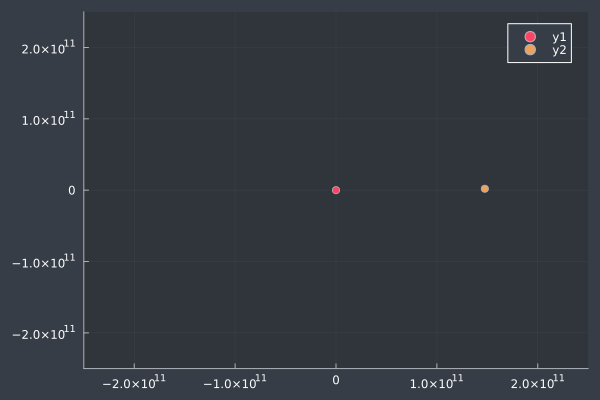

# orbital (WIP)

The goal of this code is to create simulations of a body orbiting in a 2-dimensional plane. The curve is approximated using a simple Euler Integration and creates gifs / live windows.
All the calculations are done using the language Julia and a mere single package (Plots.jl). The script contains several debugging scripts as comments.  



## Packages

```_
   _       _ _(_)_     |  
  (_)     | (_) (_)    |    Plots.jl
   _ _   _| |_  __ _   |  
  | | | | | | |/ _` |  |    (PlotThemes.jl)
  | | |_| | | | (_| |  |  
 _/ |\__'_|_|_|\__'_|  |  
|__/                   |
```

## Physics


$$|\vec{F_G}|=G\frac{M\cdot m}{|\vec{r}|^2}$$


$$\sum \vec{F} = m \cdot |\vec{a}|$$


$$\implies |\vec{a}| = \frac{F}{m} = \frac{G\cdot M}{|\vec{r}|^2}$$


Now that we know the magnitude of the acceleration vector, we need its direction. We get it by calculating the vector from our moving body towards the stationary object. 

Having that vector lets us norm it and scale it by the length of $\vec{a}$ to receive our full acceleration vector $\vec{a}$. This can be simplified into the equation to receive a simple formula for the acceleration.


$$\vec{a} = \hat{r} \cdot \frac{G\cdot M}{|\vec{r}|^2} = \frac{\vec{r}}{|\vec{r}|} \cdot \frac{G\cdot M}{|\vec{r}|^2} = \vec{r} \cdot \frac{G\cdot M}{|\vec{r}|^3}$$


Now, the only thing missing is to calculate new velocity and position in each frame. 
### Simple Euler Integration
Since this is a basic mechanical movement, the Euler Integration is very elementary. The curve is approximated by treating the velocity as linear on a small scale. 


$$\vec{v}(t+\Delta t)=\vec{v}(t)+\vec{a}\cdot \Delta t$$


And similarly to that, we update the position vector


$$\vec{p}(t+\Delta t)=\vec{p}(t)+\vec{v}\cdot \Delta t$$


## Constants & Units
Across the entire script, we shall assume lengths to be in meters, times to be in seconds, mass to be in kg. Values need to be scaled accordingly.

A given constant is 


$$G=6.67428*10^{-12} \frac{m^3}{kg\cdot s^2}$$
